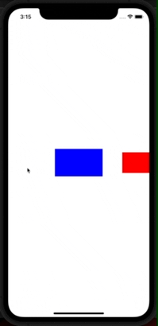

# MMMHorizontalPicker

[](https://github.com/mediamonks/MMMHorizontalPicker/actions?query=workflow%3ABuild)

(This is a part of `MMMTemple` suite of iOS libraries we use at [MediaMonks](https://www.mediamonks.com/).)

## Demo



## Installation

Podfile:

```ruby
source 'https://github.com/mediamonks/MMMSpecs.git'
source 'https://github.com/CocoaPods/Specs.git'
...
pod 'MMMHorizontalPicker'
```

SPM:

```swift
.package(url: "https://github.com/mediamonks/MMMHorizontalPicker", .upToNextMajor(from: "1.1.0"))
```

## Usage

Simply add a `MMMHorizontalPicker` to your `UIView`, afterwards there are multiple configuration options available.

```swift
// Initialise a new picker, more info on the styles below.
let pickerView = MMMHorizontalPicker(style: .default)

// You probably want to layout the picker as well.
addSubview(pickerView)

// Optional view which when set is used to calculate prefered height of the picker.
pickerView.prototypeView = ItemView() 

// Setting the delegate is essential to supply the picker with views.
pickerView.delegate = self 

// The distance to keep between two neigbour item views.
pickerView.spacing = 30

// All the item views will be positioned within the rect obtained by insetting the bounds
// by these insets.
pickerView.contentInsets = .init(top: 0, left: 30, bottom: 0, right: 30)

// The current index of the pickerView, read-only.
print("Index: ", pickerView.currentItemIndex)

// Set the current index of the pickerView, will scroll to the index.
pickerView.setCurrentItemIndex(2, animated: true)

// Should be called when the number of items change.
pickerView.reload()

```

### MMMHorizontalPickerDelegate

```swift
func numberOfItemsForHorizontalPicker(_ picker: MMMHorizontalPicker) -> Int {
    // Return the number of items in your picker.
    return 5
}

func horizontalPicker(_ picker: MMMHorizontalPicker, viewForItemWith index: Int) -> UIView {
    // Return the UIView for a item on a certain index.
    return ItemView(index: index)
}

func horizontalPickerDidChangeCurrentItemIndex(_ picker: MMMHorizontalPicker) {
    // The user swiped or pickerView.setCurrentItemIndex() was called.
    print("Current item index changed:", picker.currentItemIndex)
}
    
func horizontalPicker(_ picker: MMMHorizontalPicker, recycle view: UIView) {
    // Called after an item view becomes invisible and is removed from the picker. The delegate
    // can choose to store it somewhere and reuse it later or can just forget it and simply use 
    // a new view next time.
}

func horizontalPicker(_ picker: MMMHorizontalPicker, prepare view: UIView) {
    // Called after the given item view is added into the view hierarchy.
}

func horizontalPicker(_ picker: MMMHorizontalPicker, didScroll offset: CGFloat) {
    // Called when the picker scrolls to a new offset.
}

func horizontalPicker(_ picker: MMMHorizontalPicker, update view: UIView, centerProximity: CGFloat) {
    
    // Called every time the viewport position changes (every frame in case of animation or dragging) 
    // with an updated "center proximity" value for each visible item view.
    //
    // "Center proximity" is a difference between the center of the item and the current viewport 
    // position in "index space" coordinates.
    //
    // For example, if the current item is in the center of the view port already, then its 
    // "center proximiy" value will be 0, and the same value for the view right (left) to the central
    // item will be 1 (-1). When dragging the contents so the right view gets closer to the center, 
    // then its center proximity will be continously approaching 0.
    //
    // This is handy when you need to dim or transforms items when they get farther from the center, 
    // but be careful with doing heavy things here.
}
```

### Styles

 - `default` In this mode all item views define their preferred width via Auto Layout.
 - `paged` In this mode the width of every item will be constrainted to the width of the picker adjusted to `contentInsets`.
 - `uniform` In this mode the width of every item will be constrainted to the width of the widest item adjusted to `contentInsets`.
